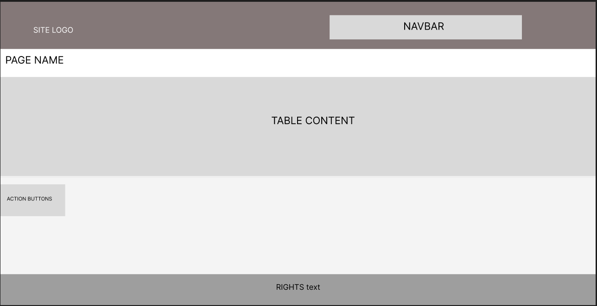
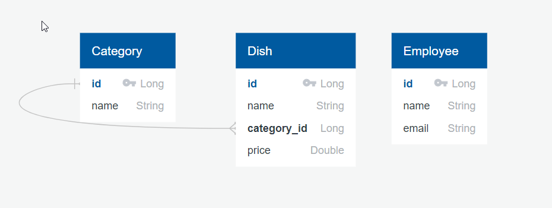

## Restaurant Menu Management System

#### Functional Requirements

#### User Stories

1. As a restaurant manager, I want to manage dishes so that I can add new dishes
2. As a restaurant manager, I want to manage categories so that I can add new categories
3. As a restaurant manager, I want to manage employees so that I can add new employees
4. As a restaurant manager, I want to view all dishes so that I can oversee the restaurant's offerings.
5. As a restaurant manager, I want to view all categories so that I can understand the variety of dishes we offer.
6. As a restaurant manager, I want to view all employees so that I can manage staffing and roles.
7. As a restaurant manager, I want to have a secure login system so that only I can access the management system.
8. As a restaurant manager, I want the system to automatically update dish prices each month based on a predefined rule, so that I can manage pricing effectively.
9. As a restaurant manager, I want to modify all information about any dish so that I can manage inventory.
10. As a restaurant manager, I want to modify all information about any category so that I can manage the menu.
11. As a restaurant manager, I want to modify all information about any employee so that I can manage staffing.
12. As a restaurant manager, I want to delete any dish.
13. As a restaurant manager, I want to delete any category.
14. As a restaurant manager, I want to delete any employee.

#### REST API Endpoints
| Method | Path             | Arguments/RequestBody | Response           | Description                            |
|--------|------------------|-----------------------|--------------------|----------------------------------------|
| GET    | /dishes          | -                     | List of dishes     | Retrieve all dishes                    |
| GET    | /dishes/{id}     | id: Long              | Dish               | Retrieve a specific dish by its id     |
| POST   | /dishes          | Dish                  | Dish               | Create a new dish                      |
| PUT    | /dishes/{id}     | id: Long, Dish        | Dish               | Update a specific dish by its id       |
| DELETE | /dishes/{id}     | id: Long              | -                  | Delete a specific dish by its id       |
| GET    | /categories      | -                     | List of categories | Retrieve all categories                |
| GET    | /categories/{id} | id: Long              | Category           | Retrieve a specific category by its id |
| POST   | /categories      | Category              | Category           | Create a new category                  |
| PUT    | /categories/{id} | id: Long, Category    | Category           | Update a specific category by its id   |
| DELETE | /categories/{id} | id: Long              | -                  | Delete a specific category by its id   |
| GET    | /employees       | -                     | List of employees  | Retrieve all employees                 |
| GET    | /employees/{id}  | id: Long              | employee           | Retrieve a specific employee by its id |
| POST   | /employees       | employee              | employee           | Create a new employee                  |
| PUT    | /employees/{id}  | id: Long, employee    | employee           | Update a specific employee by its id   |
| DELETE | /employees/{id}  | id: Long              | -                  | Delete a specific employee by its id   |
| POST   | /orders          | Order                 | Order              | Create a new order                     |
| PUT    | /orders/{id}     | id: Long, Order       | Order              | Update a specific order by its id      |
| DELETE | /orders/{id}     | id: Long              | -                  | Delete a specific order by its id      |


#### Web UI pages (Server Side Rendering)

1. Home
2. List Dishes
3. Dish Details
4. List Categories
5. Category Details
6. List employees
7. employee Details


#### Mockups
in addition to main page each entity has a list page and a details(editing) page, so here is a rough design for them




#
### ERD

#### ERD code
```
Category
-
id PK Long
name String

Dish
-
id PK Long
name String
category_id Long FK >- Category.id
price Double

Employee
-
id PK Long
name String
email String
```
#### ERD code reader
https://app.quickdatabasediagrams.com/#/